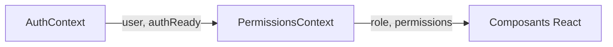
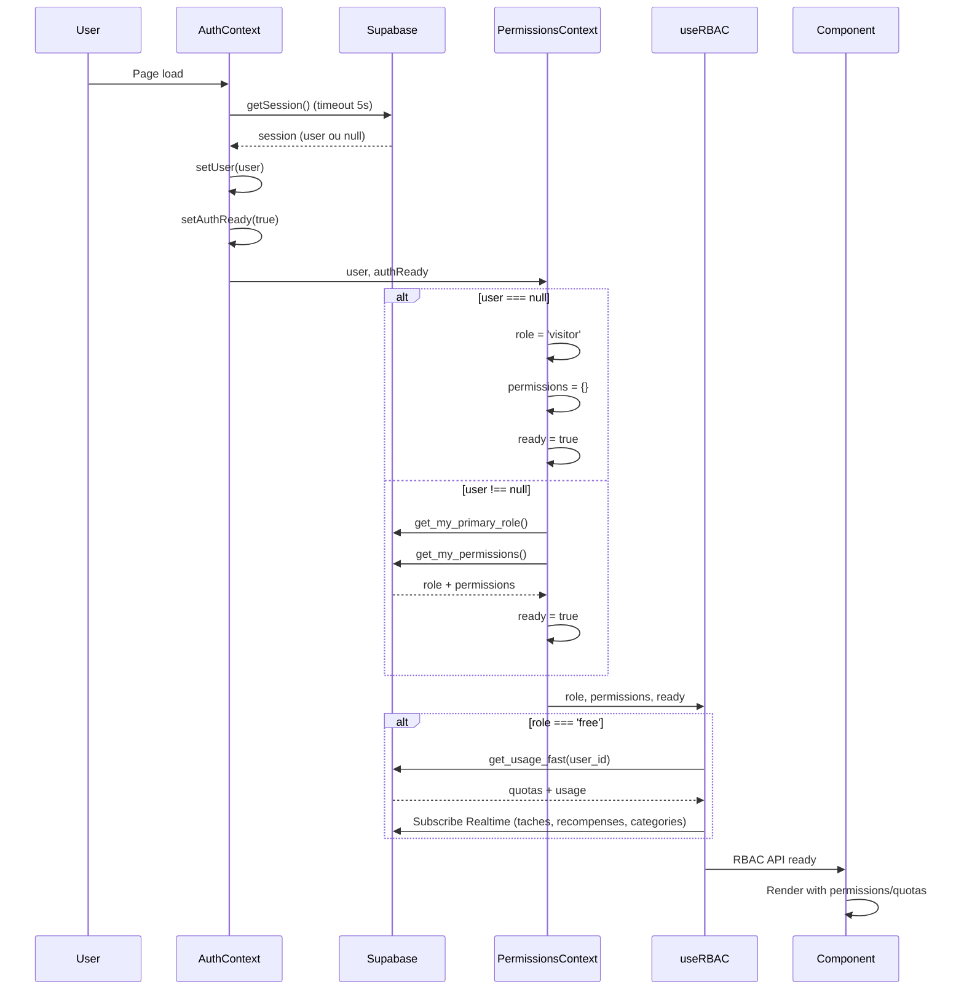
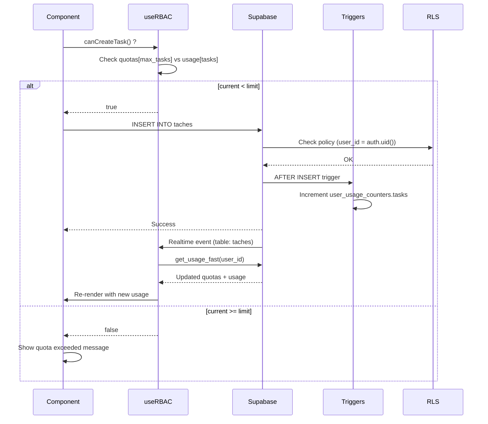
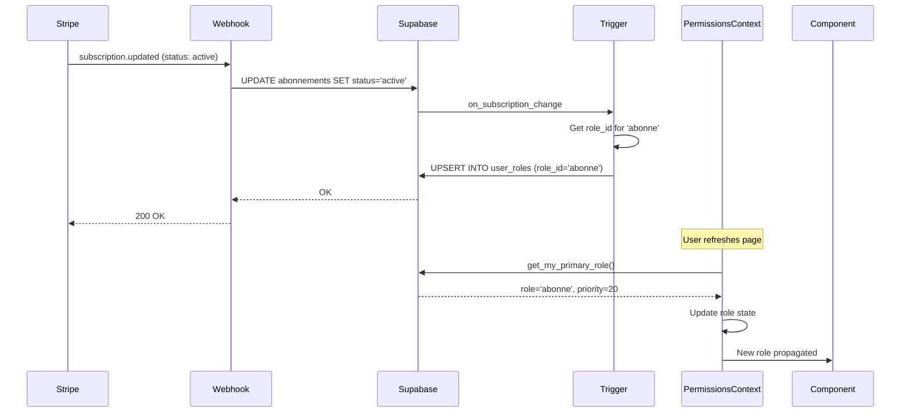
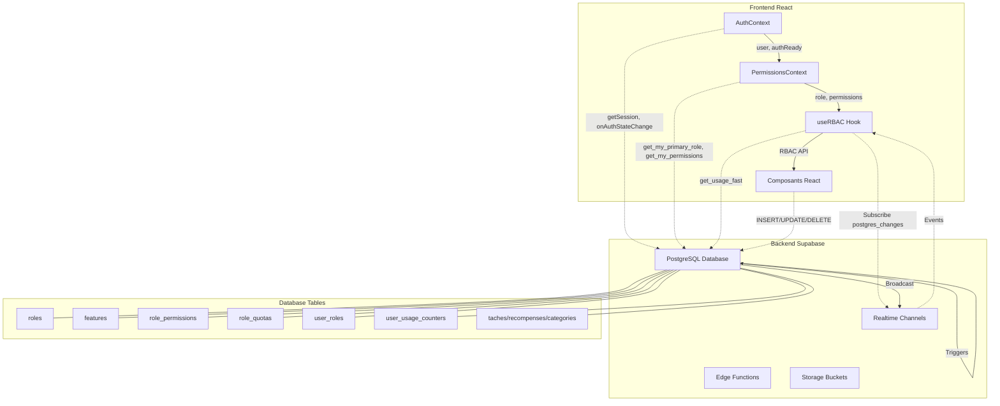
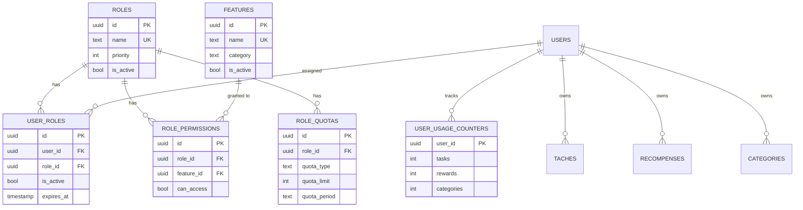
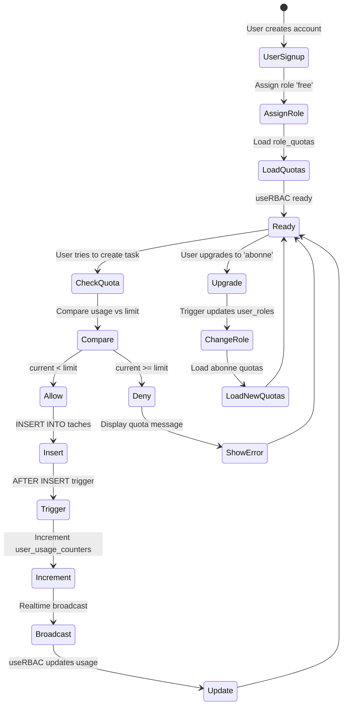

# 🔐 Système RBAC & Quotas - Appli-Picto

> Documentation complète du système de contrôle d'accès basé sur les rôles (RBAC) et de gestion des quotas utilisateurs.

**Version** : 2.0 (Phase 2-3 Refactoring)
**Dernière mise à jour** : 2025-01
**Auteur** : Système automatisé d'analyse Claude Code

---

## 📋 Table des matières

1. [Vue d'ensemble](#-vue-densemble)
2. [Architecture Base de Données](#-architecture-base-de-données)
3. [Système de Rôles](#-système-de-rôles)
4. [Système de Quotas](#-système-de-quotas)
5. [Contextes React](#-contextes-react)
6. [Hooks Personnalisés](#-hooks-personnalisés)
7. [Flux de Données](#-flux-de-données)
8. [Cas d'Usage Pratiques](#-cas-dusage-pratiques)
9. [Sécurité (RLS)](#-sécurité-rls)
10. [Optimisations & Performance](#-optimisations--performance)
11. [Diagrammes](#-diagrammes)
12. [Référence API](#-référence-api)

---

## 🎯 Vue d'ensemble

Le système RBAC + Quotas d'Appli-Picto est une **architecture complète** de contrôle d'accès qui combine :

- ✅ **RBAC (Role-Based Access Control)** : Permissions basées sur les rôles
- ✅ **Quotas dynamiques** : Limites par rôle (total et mensuel)
- ✅ **Realtime updates** : Synchronisation automatique via Supabase Realtime
- ✅ **RLS (Row Level Security)** : Sécurité côté serveur PostgreSQL
- ✅ **API unifiée** : Hook unique `useRBAC()` pour toutes les vérifications

### Principes de conception

1. **Sécurité par défaut** : Toutes les données sont privées (RLS enforced)
2. **Single source of truth** : Base de données Supabase comme référence
3. **Performance** : Single RPC call (`get_usage_fast`) au lieu de multiples requêtes
4. **Simplicité** : API unifiée pour développeurs (hook `useRBAC`)
5. **Évolutivité** : Système extensible (nouveaux rôles, features, quotas)

---

## 🗄️ Architecture Base de Données

### Tables principales

#### `roles` - Définition des rôles

| Colonne        | Type    | Description                                  |
| -------------- | ------- | -------------------------------------------- |
| `id`           | uuid    | ID unique du rôle                            |
| `name`         | text    | Nom technique (visitor, free, abonne, admin) |
| `display_name` | text    | Nom affiché (ex: "Administrateur")           |
| `description`  | text    | Description du rôle                          |
| `priority`     | integer | Priorité (100=admin, 0=visitor)              |
| `is_active`    | boolean | Rôle actif ou désactivé                      |

**Rôles actuels** (ordre de priorité) :

```sql
admin    → priority 100 (accès illimité)
staff    → priority 90  (support technique)
abonne   → priority 20  (abonné payant)
free     → priority 10  (compte gratuit)
visitor  → priority 0   (non connecté)
```

#### `features` - Fonctionnalités disponibles

| Colonne        | Type    | Description                          |
| -------------- | ------- | ------------------------------------ |
| `id`           | uuid    | ID unique de la feature              |
| `name`         | text    | Nom technique (ex: edit_tasks)       |
| `display_name` | text    | Nom affiché                          |
| `description`  | text    | Description de la fonctionnalité     |
| `category`     | text    | Catégorie (affichage, gestion, etc.) |
| `is_active`    | boolean | Feature active ou désactivée         |

**Catégories disponibles** :

- `affichage` : Features d'affichage (UI)
- `gestion` : Features de gestion (CRUD)
- `systeme` : Features système (config)
- `securite` : Features de sécurité (admin)

#### `role_permissions` - Matrice rôles × features

| Colonne      | Type    | Description                |
| ------------ | ------- | -------------------------- |
| `id`         | uuid    | ID unique de la permission |
| `role_id`    | uuid    | FK vers `roles.id`         |
| `feature_id` | uuid    | FK vers `features.id`      |
| `can_access` | boolean | Accès autorisé ou non      |

**Important** : Les admins ont **toujours** accès à toutes les features (logique côté serveur).

#### `role_quotas` - Quotas par rôle

| Colonne        | Type    | Description                         |
| -------------- | ------- | ----------------------------------- |
| `id`           | uuid    | ID unique du quota                  |
| `role_id`      | uuid    | FK vers `roles.id`                  |
| `quota_type`   | text    | Type (max_tasks, max_rewards, etc.) |
| `quota_limit`  | integer | Limite maximale                     |
| `quota_period` | text    | Période (total, monthly, daily)     |

**Quotas actuels** (par rôle) :

| Rôle    | Type              | Limite | Période |
| ------- | ----------------- | ------ | ------- |
| free    | max_tasks         | 5      | monthly |
| free    | max_rewards       | 2      | monthly |
| free    | max_categories    | 2      | total   |
| free    | max_task_images   | 5      | total   |
| free    | max_reward_images | 2      | total   |
| free    | max_total_images  | 7      | total   |
| free    | max_image_size    | 102400 | total   |
| abonne  | max_tasks         | 40     | total   |
| abonne  | max_rewards       | 10     | total   |
| abonne  | max_categories    | 50     | total   |
| abonne  | max_task_images   | 40     | total   |
| abonne  | max_reward_images | 10     | total   |
| abonne  | max_total_images  | 50     | total   |
| abonne  | max_image_size    | 102400 | total   |
| visitor | max_tasks         | 3      | total   |
| visitor | max\_\*           | 0      | total   |

#### `user_roles` - Attribution des rôles aux utilisateurs

| Colonne       | Type      | Description                  |
| ------------- | --------- | ---------------------------- |
| `id`          | uuid      | ID unique de l'attribution   |
| `user_id`     | uuid      | FK vers `auth.users.id`      |
| `role_id`     | uuid      | FK vers `roles.id`           |
| `is_active`   | boolean   | Attribution active           |
| `assigned_by` | uuid      | Qui a assigné ce rôle        |
| `assigned_at` | timestamp | Date d'attribution           |
| `expires_at`  | timestamp | Date d'expiration (nullable) |

**Logique** : Un utilisateur peut avoir **plusieurs rôles**, mais le système utilise le rôle avec la **priorité la plus élevée**.

#### `user_usage_counters` - Compteurs d'utilisation

| Colonne      | Type      | Description                  |
| ------------ | --------- | ---------------------------- |
| `user_id`    | uuid      | FK vers `auth.users.id` (PK) |
| `tasks`      | integer   | Nombre de tâches actuelles   |
| `rewards`    | integer   | Nombre de récompenses        |
| `categories` | integer   | Nombre de catégories         |
| `updated_at` | timestamp | Dernière mise à jour         |

**Synchronisation** : Mis à jour automatiquement via **triggers** sur `INSERT`/`DELETE` dans `taches`, `recompenses`, `categories`.

#### Tables auxiliaires

- **`permission_changes`** : Audit trail des modifications de permissions (qui, quand, quoi)
- **`account_audit_logs`** : Logs des changements de statut/rôle des comptes
- **`user_assets`** : Métadonnées des images uploadées par utilisateur

---

### Fonctions SQL (RPC)

#### `get_my_primary_role()` - Rôle principal de l'utilisateur

```sql
CREATE FUNCTION public.get_my_primary_role()
  RETURNS TABLE(role_id uuid, role_name text, priority integer)
```

**Logique** :

1. Récupère tous les rôles actifs de l'utilisateur connecté (`auth.uid()`)
2. Trie par priorité **descendante** (le plus élevé en premier)
3. Retourne le **premier** rôle (priorité max)

**Retour** :

```json
{
  "role_id": "uuid",
  "role_name": "free",
  "priority": 10
}
```

#### `get_my_permissions()` - Permissions de l'utilisateur

```sql
CREATE FUNCTION public.get_my_permissions()
  RETURNS TABLE(feature_name text, can_access boolean)
```

**Logique** :

1. Appelle `_compute_my_primary_role()` pour obtenir le rôle
2. Si rôle = `admin` → **toutes** les features retournent `can_access = true`
3. Sinon → JOIN `role_permissions` pour obtenir les permissions exactes
4. Retourne une liste `{feature_name, can_access}`

**Retour** :

```json
[
  { "feature_name": "edit_tasks", "can_access": true },
  { "feature_name": "delete_tasks", "can_access": false }
]
```

#### `get_usage_fast(p_user_id uuid)` - Quotas + Usage (optimisé)

```sql
CREATE FUNCTION public.get_usage_fast(p_user_id uuid)
  RETURNS jsonb
```

**Optimisation** : **Single RPC call** qui retourne rôle + quotas + usage en un seul aller-retour réseau.

**Logique** :

1. Vérifie que l'appelant est `self` ou `admin` (sécurité)
2. Récupère le rôle principal via JOIN `user_roles` × `roles`
3. Si aucun rôle → fallback : cherche abonnement Stripe actif → `abonne` ou `visitor`
4. Récupère les quotas du rôle via JOIN `role_quotas`
5. Récupère l'usage actuel via `user_usage_counters`
6. Retourne un **JSONB complet**

**Retour** :

```json
{
  "role": {
    "id": "uuid",
    "name": "free",
    "priority": 10
  },
  "quotas": [
    { "quota_type": "max_tasks", "quota_limit": 5, "quota_period": "monthly" },
    { "quota_type": "max_rewards", "quota_limit": 2, "quota_period": "monthly" }
  ],
  "usage": {
    "tasks": 3,
    "rewards": 1,
    "categories": 1
  }
}
```

#### `is_admin()` - Vérification admin

```sql
CREATE FUNCTION public.is_admin()
  RETURNS boolean
```

**Logique** :

1. Vérifie si l'utilisateur a le rôle `admin` dans `user_roles` (actif)
2. OU vérifie si `profiles.is_admin = true` (legacy)

**Retour** : `true` ou `false`

**Utilisation** : Utilisé dans **toutes les RLS policies** pour donner accès illimité aux admins.

---

### Triggers

#### Triggers de compteurs (user_usage_counters)

**Sur `taches`** :

- `trg_taches_ctr_ins` : `AFTER INSERT` → incrémente `tasks`
- `trg_taches_ctr_del` : `AFTER DELETE` → décrémente `tasks`

**Sur `recompenses`** :

- `trg_recompenses_ctr_ins` : `AFTER INSERT` → incrémente `rewards`
- `trg_recompenses_ctr_del` : `AFTER DELETE` → décrémente `rewards`

**Sur `categories`** :

- `trg_categories_ctr_ins` : `AFTER INSERT` → incrémente `categories`
- `trg_categories_ctr_del` : `AFTER DELETE` → décrémente `categories`

**Avantage** : Compteurs **toujours à jour** sans overhead côté client.

#### Triggers d'audit

**Sur `roles`, `features`, `role_permissions`, `user_roles`** :

- `audit_*_changes` : Enregistre les modifications dans `permission_changes`

**Trigger d'abonnement** :

- `on_subscription_change` sur `abonnements` : Synchronise automatiquement le rôle utilisateur quand l'abonnement Stripe change (active → abonne, canceled → free)

#### Triggers de validation

- `prevent_system_role_delete` : Empêche la suppression des rôles système (visitor, free, abonne, admin)
- `prevent_system_role_deletion` : Empêche la désactivation des rôles système

---

## 👤 Système de Rôles

### Hiérarchie des rôles

```
┌─────────────────────────────────────┐
│         admin (priority: 100)       │  ← Accès ILLIMITÉ
│   - Toutes permissions              │
│   - Pas de quotas                   │
│   - Accès admin panel               │
└─────────────────────────────────────┘
              ↓
┌─────────────────────────────────────┐
│         staff (priority: 90)        │  ← Support technique
│   - Permissions étendues            │
│   - Pas de quotas                   │
└─────────────────────────────────────┘
              ↓
┌─────────────────────────────────────┐
│        abonne (priority: 20)        │  ← Abonné payant
│   - Permissions complètes           │
│   - Quotas généreux (40/10/50)      │
└─────────────────────────────────────┘
              ↓
┌─────────────────────────────────────┐
│         free (priority: 10)         │  ← Compte gratuit
│   - Permissions standard            │
│   - Quotas limités (5/2/2)          │
└─────────────────────────────────────┘
              ↓
┌─────────────────────────────────────┐
│       visitor (priority: 0)         │  ← Non connecté
│   - Mode démo uniquement            │
│   - 3 tâches démo, lecture seule    │
└─────────────────────────────────────┘
```

### Rôle `visitor` (non connecté)

**Caractéristiques** :

- ❌ Pas d'authentification requise
- ✅ Accès aux **demo_cards** (3 tâches prédéfinies)
- ❌ Pas de création/modification/suppression
- ❌ Pas d'upload d'images
- ✅ Interface en **lecture seule**

**Cas d'usage** : Découverte de l'application avant inscription.

### Rôle `free` (compte gratuit)

**Caractéristiques** :

- ✅ Authentification requise
- ✅ CRUD complet (tâches, récompenses, catégories)
- ⚠️ **Quotas mensuels** : 5 tâches, 2 récompenses
- ⚠️ **Quotas totaux** : 2 catégories, 7 images max
- ✅ Upload d'images (max 100KB par image)

**Quotas détaillés** :

```javascript
{
  max_tasks: 5,           // mensuel
  max_rewards: 2,         // mensuel
  max_categories: 2,      // total
  max_task_images: 5,     // total
  max_reward_images: 2,   // total
  max_total_images: 7,    // total
  max_image_size: 102400  // 100KB par image
}
```

**Cas d'usage** : Utilisateur qui teste l'application gratuitement.

### Rôle `abonne` (abonné payant)

**Caractéristiques** :

- ✅ Authentification requise
- ✅ CRUD complet illimité
- ✅ **Quotas généreux** : 40 tâches, 10 récompenses
- ✅ **Quotas totaux** : 50 catégories, 50 images max
- ✅ Upload d'images (max 100KB par image)
- ✅ Accès features premium (si implémentées)

**Quotas détaillés** :

```javascript
{
  max_tasks: 40,          // total
  max_rewards: 10,        // total
  max_categories: 50,     // total
  max_task_images: 40,    // total
  max_reward_images: 10,  // total
  max_total_images: 50,   // total
  max_image_size: 102400  // 100KB par image
}
```

**Attribution** : Automatique via webhook Stripe (`handle_subscription_role_change`)

**Cas d'usage** : Utilisateur qui paie un abonnement mensuel.

### Rôle `admin` (administrateur)

**Caractéristiques** :

- ✅ **Accès illimité** à tout
- ✅ Pas de quotas
- ✅ Accès à l'admin panel
- ✅ Peut gérer les utilisateurs, rôles, permissions
- ✅ Bypass de toutes les RLS policies (via `is_admin()`)

**Attribution** : Manuelle via SQL ou admin panel

**Cas d'usage** : Équipe de développement, gestionnaires du projet.

### Rôle `staff` (support)

**Caractéristiques** :

- ✅ Permissions étendues (définies dans `role_permissions`)
- ✅ Pas de quotas
- ❌ Pas d'accès admin complet (contrairement à `admin`)

**Attribution** : Manuelle

**Cas d'usage** : Équipe de support technique.

---

## 📊 Système de Quotas

### Types de quotas

#### Quotas **totaux** (`quota_period = 'total'`)

Limite **absolue** sur le nombre d'éléments créés (toute la durée de vie du compte).

**Exemples** :

- `max_categories: 2` → Maximum 2 catégories **en même temps**
- `max_total_images: 7` → Maximum 7 images **stockées**

**Logique** :

- Compte basé sur `user_usage_counters.categories`, `.tasks`, etc.
- Si l'utilisateur **supprime** une catégorie, le compteur **décrémente** → quota libéré

#### Quotas **mensuels** (`quota_period = 'monthly'`)

Limite sur le nombre d'éléments créés **par mois civil**.

**Exemples** :

- `max_tasks: 5` (free) → Maximum 5 tâches créées **ce mois-ci**
- `max_rewards: 2` (free) → Maximum 2 récompenses créées **ce mois-ci**

**⚠️ Note** : La logique mensuelle n'est **pas encore implémentée côté frontend**. Actuellement, le système traite tous les quotas comme `total`. Une future migration ajoutera un compteur mensuel séparé.

#### Quotas **d'images**

Quotas spécifiques aux uploads d'images :

- `max_task_images` : Nombre d'images pour tâches
- `max_reward_images` : Nombre d'images pour récompenses
- `max_total_images` : Total d'images stockées
- `max_image_size` : Taille max par image (100KB = 102400 bytes)
- `max_total_images_size` : Taille totale de toutes les images

**Vérifications** :

- Avant upload : `check_image_quota()` (fonction SQL)
- Après upload : Métriques stockées dans `image_metrics`
- Déduplication : Hash SHA-256 dans `user_assets.sha256_hash`

### Vérification des quotas

#### Côté serveur (PostgreSQL)

**Fonction `get_usage_fast`** : Retourne quotas + usage en temps réel.

**Avantages** :

- ✅ Source de vérité unique
- ✅ Impossible de bypass côté client
- ✅ Performance optimale (single query)

#### Côté client (React)

**Hook `useRBAC`** : Expose les quotas et usage.

```javascript
const { canCreateTask, getQuotaInfo } = useRBAC()

// Vérifier si création possible
if (!canCreateTask()) {
  const info = getQuotaInfo('task')
  alert(`Limite atteinte : ${info.current}/${info.limit}`)
  return
}

// Créer la tâche
await createTask(...)
```

**Pattern recommandé** :

1. Vérifier `canCreateTask()` **avant** d'afficher le bouton
2. Vérifier **à nouveau** côté serveur (RLS + triggers)
3. Double sécurité : UX fluide + sécurité garantie

### Réinitialisation des quotas

#### Quotas mensuels (futures)

**Logique prévue** :

- Compteur mensuel séparé (`monthly_tasks`, `monthly_rewards`, etc.)
- Réinitialisation automatique le 1er de chaque mois (cron job)
- Audit trail dans `account_audit_logs`

#### Quotas totaux

**Logique actuelle** :

- Pas de réinitialisation automatique
- Libération lors de suppression (triggers décrémentent)

**Exemple** :

- Free user crée 5 tâches → quota atteint
- Free user supprime 2 tâches → quota = 3/5 → peut créer 2 nouvelles

---

## ⚛️ Contextes React

### AuthContext

**Fichier** : `src/contexts/AuthContext.jsx`

**Responsabilités** :

1. ✅ Gérer la session utilisateur (`user`)
2. ✅ Écouter les changements d'auth (`onAuthStateChange`)
3. ✅ Annoncer quand l'auth est prête (`authReady`)
4. ✅ Gérer la reconnexion après changement d'onglet
5. ✅ Fournir `signOut()`

**API exposée** :

```typescript
{
  user: User | null,           // Utilisateur Supabase (ou null si déconnecté)
  authReady: boolean,          // True quand décision prise (connecté ou non)
  loading: boolean,            // Inverse de authReady (compatibilité)
  error: Error | null,         // Erreur éventuelle
  signOut: () => Promise<void> // Déconnexion
}
```

**Cycle de vie** :

1. **Mount** → `getSession()` avec timeout 5s
2. Si timeout → recréer le SDK client (correctif deadlock)
3. Listener `onAuthStateChange` → met à jour `user`
4. Listener `supabase-client-recreated` → rafraîchit après recréation SDK
5. Visibility handler → reconnecte après retour d'onglet

**Optimisations** :

- ✅ Timeout sur `getSession()` (évite blocage infini)
- ✅ Recréation SDK en cas de deadlock
- ✅ Visibility handler pour reconnexion
- ✅ `authReady = true` même en erreur (ne jamais bloquer l'UI)

### PermissionsContext

**Fichier** : `src/contexts/PermissionsContext.jsx`

**Responsabilités** :

1. ✅ Charger le rôle principal (`get_my_primary_role`)
2. ✅ Charger les permissions (`get_my_permissions`)
3. ✅ Normaliser le rôle (`visitor`, `free`, `abonne`, `admin`, `unknown`)
4. ✅ Fournir `can()`, `canAll()`, `canAny()`
5. ✅ Gérer l'état transitoire (`unknown` avant ready)

**API exposée** :

```typescript
{
  ready: boolean,              // True quand décision prise
  loading: boolean,            // Inverse de ready
  role: string,                // 'visitor' | 'free' | 'abonne' | 'admin' | 'unknown'

  // Flags pratiques
  isUnknown: boolean,          // État transitoire
  isVisitor: boolean,          // Non connecté
  isAdmin: boolean,            // Administrateur

  // Map des permissions
  permissions: {[key: string]: boolean},

  // Fonctions de vérification
  can: (featureName: string) => boolean,
  canAll: (features: string[]) => boolean,
  canAny: (features: string[]) => boolean,

  // Reload
  reload: () => Promise<void>,
  error: Error | null
}
```

**Cycle de vie** :

1. **Attend** `authReady` du `AuthContext`
2. Si `!user` → `role = visitor` (immédiat)
3. Si `user` → RPC `get_my_primary_role` + `get_my_permissions`
4. **Retry exponentiel** sur erreurs transitoires (JWT, session manquante)
5. Listener `onAuthStateChange` → reload sur changement
6. `ready = true` dès que décision prise

**Optimisations** :

- ✅ Retry avec backoff exponentiel (0ms, 200ms, 400ms, 800ms, 1600ms)
- ✅ Parallélisation des 2 RPC (`Promise.all`)
- ✅ Cleanup synchrone du listener (évite fuites)
- ✅ `ready = true` même en erreur (failsafe)

**Relation avec AuthContext** :



---

## 🎣 Hooks Personnalisés

### useRBAC (Hook unifié)

**Fichier** : `src/hooks/useRBAC.js`

**Philosophie** : **Single API** pour TOUT le RBAC (rôles + permissions + quotas).

**Remplace** :

- ❌ `useQuotas()` (déprécié)
- ❌ `useEntitlements()` (déprécié)
- ⚠️ `usePermissions()` (toujours OK si pas besoin de quotas)

**Architecture interne** :

```javascript
useRBAC() {
  // 1. Récupère permissions depuis PermissionsContext
  const permissions = usePermissions()

  // 2. Si free account → fetch quotas via get_usage_fast
  const [quotas, usage] = useState({})

  // 3. Si free account → Realtime updates sur taches/recompenses/categories
  useEffect(() => {
    const channel = supabase.channel('rbac:quotas:changes')
      .on('postgres_changes', { table: 'taches' }, handleChange)
      .subscribe()
  }, [])

  // 4. API unifiée
  return {
    ...permissions,
    quotas,
    usage,
    canCreate,
    getQuotaInfo
  }
}
```

**API complète** :

```typescript
{
  // État
  ready: boolean,              // Permissions ET quotas chargés
  loading: boolean,            // Inverse de ready
  role: string,                // Rôle actuel

  // Flags de rôle
  isVisitor: boolean,
  isFree: boolean,
  isSubscriber: boolean,
  isAdmin: boolean,
  isUnknown: boolean,

  // Permissions
  can: (feature: string) => boolean,
  canAll: (features: string[]) => boolean,
  canAny: (features: string[]) => boolean,

  // Quotas
  quotas: {[key: string]: {limit: number, period: string}},
  usage: {[key: string]: number},

  canCreate: (type: 'task'|'reward'|'category') => boolean,
  canCreateTask: () => boolean,
  canCreateReward: () => boolean,
  canCreateCategory: () => boolean,

  getQuotaInfo: (type: string) => QuotaInfo | null,
  getMonthlyQuotaInfo: (type: string) => QuotaInfo | null,

  // Actions
  refreshQuotas: () => void,
  reload: () => void
}
```

**Type QuotaInfo** :

```typescript
{
  limit: number,      // Limite max
  current: number,    // Usage actuel
  remaining: number,  // Restant (limit - current)
  percentage: number, // Pourcentage (0-100)
  isAtLimit: boolean, // Limite atteinte ?
  isNearLimit: boolean // >80% de la limite ?
}
```

**Optimisations critiques** :

1. **Nom de channel fixe** (`rbac:quotas:changes`) :
   - ❌ Avant : `channel-${Date.now()}` → accumulation de channels zombies
   - ✅ Maintenant : nom fixe → cleanup fonctionne correctement

2. **Fonction stable** `fetchQuotasStable` :
   - Évite la récréation de channels à chaque render
   - Dépendances minimales et stables

3. **Realtime seulement pour free** :
   - Abonnés/admins n'ont pas besoin de tracking temps réel
   - Économise les connexions Realtime

4. **Memoization complète** :
   - `useMemo` pour l'objet retourné
   - `useCallback` pour toutes les fonctions
   - Évite les re-renders inutiles

### usePermissions (Accès direct)

**Fichier** : `src/contexts/PermissionsContext.jsx` (hook exporté)

**Usage** : Accès direct au `PermissionsContext` sans quotas.

```javascript
import { usePermissions } from '@/contexts/PermissionsContext'

const { role, can, isAdmin } = usePermissions()
```

**Quand l'utiliser** :

- ✅ Si vous n'avez **pas besoin** de quotas
- ✅ Composants simples (header, menu, etc.)
- ✅ Vérifications de rôle uniquement

**Quand utiliser useRBAC** :

- ✅ Si vous avez besoin de quotas
- ✅ Pages avec CRUD (édition, création)
- ✅ API unifiée recommandée

### usePermissionsAPI (Utilitaire admin)

**Fichier** : `src/hooks/usePermissionsAPI.js`

**Usage** : Outils pour admin panel / debug.

```javascript
const api = usePermissionsAPI()

// RPC
await api.getMyPrimaryRole()
await api.getMyPermissions()

// Queries
await api.getFeatures()
await api.getAllPermissions()
```

**Cas d'usage** :

- Admin panel : liste des features, permissions
- Debug : afficher rôle actuel, permissions brutes
- Tests : inspecter l'état RBAC

---

## 🔄 Flux de Données

### Flux d'authentification complet



### Flux de vérification de quota



### Flux de changement de rôle (abonnement)



---

## 🎨 Cas d'Usage Pratiques

### 1. Afficher un bouton conditionnel

```jsx
import { useRBAC } from '@/hooks'

function TaskList() {
  const { canCreateTask, getQuotaInfo, isFree } = useRBAC()

  const info = getQuotaInfo('task')

  return (
    <div>
      {/* Barre de quota pour free users */}
      {isFree && info && (
        <div className="quota-bar">
          <progress value={info.current} max={info.limit} />
          <span>
            {info.current} / {info.limit} tâches
          </span>
          {info.isNearLimit && <span>⚠️ Proche de la limite</span>}
        </div>
      )}

      {/* Bouton désactivé si quota atteint */}
      <button onClick={handleAddTask} disabled={!canCreateTask()}>
        {canCreateTask() ? 'Ajouter une tâche' : 'Quota atteint'}
      </button>
    </div>
  )
}
```

### 2. Redirection selon le rôle

```jsx
import { useRBAC } from '@/hooks'
import { Navigate } from 'react-router-dom'

function AdminRoute({ children }) {
  const { isAdmin, ready, loading } = useRBAC()

  if (loading || !ready) {
    return <Loader />
  }

  if (!isAdmin) {
    return <Navigate to="/" replace />
  }

  return children
}
```

### 3. Vérification de permissions multiples

```jsx
function AdvancedEditor() {
  const { canAll, canAny } = useRBAC()

  // Toutes les permissions requises (AND)
  const hasFullAccess = canAll([
    'edit_tasks',
    'delete_tasks',
    'manage_categories',
  ])

  // Au moins une permission (OR)
  const canViewStats = canAny(['view_analytics', 'view_reports'])

  return (
    <div>
      {hasFullAccess && <AdvancedToolbar />}
      {canViewStats && <StatsPanel />}
    </div>
  )
}
```

### 4. Gestion d'erreur quota dépassé

```jsx
function CreateTaskForm() {
  const { canCreateTask, getQuotaInfo } = useRBAC()
  const { showToast } = useToast()

  const handleSubmit = async data => {
    // Vérification côté client
    if (!canCreateTask()) {
      const info = getQuotaInfo('task')
      showToast({
        type: 'error',
        message: `Quota atteint : ${info.current}/${info.limit} tâches.
                  Passez à l'abonnement pour créer jusqu'à 40 tâches !`,
      })
      return
    }

    try {
      await createTask(data)
      showToast({ type: 'success', message: 'Tâche créée !' })
    } catch (error) {
      // Double vérification côté serveur (RLS peut aussi bloquer)
      if (error.code === 'QUOTA_EXCEEDED') {
        showToast({
          type: 'error',
          message: 'Quota dépassé (vérification serveur)',
        })
      }
    }
  }

  return <form onSubmit={handleSubmit}>...</form>
}
```

### 5. Upgrade prompt pour free users

```jsx
function UpgradePrompt() {
  const { isFree, getQuotaInfo } = useRBAC()

  if (!isFree) return null

  const taskInfo = getQuotaInfo('task')
  const rewardInfo = getQuotaInfo('reward')

  // Afficher seulement si proche de la limite
  if (!taskInfo?.isNearLimit && !rewardInfo?.isNearLimit) {
    return null
  }

  return (
    <div className="upgrade-banner">
      <p>
        Vous approchez de vos limites gratuites ! Passez à l'abonnement pour
        débloquer :
      </p>
      <ul>
        <li>40 tâches au lieu de 5</li>
        <li>10 récompenses au lieu de 2</li>
        <li>50 catégories au lieu de 2</li>
      </ul>
      <button onClick={() => navigate('/abonnement')}>
        Passer à l'abonnement (9,90€/mois)
      </button>
    </div>
  )
}
```

### 6. Debug panel (admin)

```jsx
function DebugRBAC() {
  const rbac = useRBAC()
  const api = usePermissionsAPI()

  if (!rbac.isAdmin) return null

  return (
    <details>
      <summary>🔍 Debug RBAC</summary>
      <pre>
        {JSON.stringify(
          {
            ready: rbac.ready,
            role: rbac.role,
            quotas: rbac.quotas,
            usage: rbac.usage,
            permissions: rbac.permissions,
          },
          null,
          2
        )}
      </pre>
    </details>
  )
}
```

---

## 🔒 Sécurité (RLS)

### Row Level Security (RLS)

**Principe** : Chaque table a des **policies** PostgreSQL qui filtrent automatiquement les données selon `auth.uid()`.

**Avantage** : Impossible de bypass côté client → sécurité garantie.

### Policies principales

#### Sur `taches`

```sql
-- SELECT : Seulement ses propres tâches (ou admin)
CREATE POLICY taches_select_owner_or_admin
  ON taches FOR SELECT
  USING (user_id = auth.uid() OR is_admin())

-- INSERT : Seulement avec son user_id
CREATE POLICY taches_insert_authenticated
  ON taches FOR INSERT
  WITH CHECK (user_id = auth.uid())

-- UPDATE : Seulement ses tâches (ou admin)
CREATE POLICY taches_update_unified
  ON taches FOR UPDATE
  USING (user_id = auth.uid() OR is_admin())
  WITH CHECK (user_id = auth.uid() OR is_admin())

-- DELETE : Seulement ses tâches (ou admin)
CREATE POLICY taches_delete_unified
  ON taches FOR DELETE
  USING (user_id = auth.uid() OR is_admin())
```

#### Sur `recompenses`

Identique aux tâches (ownership strict).

#### Sur `categories`

```sql
-- SELECT : Ses catégories OU catégories globales (user_id IS NULL)
CREATE POLICY categories_select_auth
  ON categories FOR SELECT
  USING (
    user_id = auth.uid()
    OR user_id IS NULL  -- Catégories système
    OR is_admin()
  )
```

#### Sur `user_roles`

```sql
-- SELECT : Seulement ses propres rôles (ou admin)
CREATE POLICY user_roles_select_unified
  ON user_roles FOR SELECT
  USING (user_id = auth.uid() OR is_admin())

-- INSERT : Admin uniquement (ou self-assign de rôles autorisés)
CREATE POLICY user_roles_insert_unified
  ON user_roles FOR INSERT
  WITH CHECK (
    is_admin()
    OR (
      user_id = auth.uid()
      AND role_id IN (SELECT id FROM roles WHERE name IN ('free', 'visitor'))
    )
  )
```

#### Sur `roles`, `features`, `role_permissions`

```sql
-- SELECT : Tous les utilisateurs authentifiés peuvent lire
CREATE POLICY roles_select_unified
  ON roles FOR SELECT
  USING (is_active = true OR is_admin())

-- INSERT/UPDATE/DELETE : Admin uniquement
-- (Omis pour concision)
```

#### Sur Storage (`images`, `avatars`)

```sql
-- Bucket 'images' : Privé (seulement ses propres fichiers)
CREATE POLICY images_select_own_files
  ON storage.objects FOR SELECT
  USING (
    bucket_id = 'images'
    AND split_part(name, '/', 1) = auth.uid()::text
  )

CREATE POLICY images_upload_own_files
  ON storage.objects FOR INSERT
  WITH CHECK (
    bucket_id = 'images'
    AND split_part(name, '/', 1) = auth.uid()::text
  )

-- Admin a accès complet
CREATE POLICY images_select_admin
  ON storage.objects FOR SELECT
  USING (bucket_id = 'images' AND is_admin())
```

### Fonction `is_admin()`

**Rôle critique** : Utilisée dans **toutes** les policies pour donner accès illimité aux admins.

```sql
CREATE FUNCTION is_admin() RETURNS boolean AS $$
  SELECT EXISTS (
    SELECT 1 FROM user_roles ur
    JOIN roles r ON r.id = ur.role_id
    WHERE ur.user_id = auth.uid()
      AND ur.is_active
      AND r.name = 'admin'
  ) OR EXISTS (
    SELECT 1 FROM profiles p
    WHERE p.id = auth.uid()
      AND p.is_admin
  )
$$ LANGUAGE sql SECURITY DEFINER;
```

**Double check** :

1. Vérifie `user_roles` (système actuel)
2. Vérifie `profiles.is_admin` (legacy, backward compatibility)

---

## ⚡ Optimisations & Performance

### 1. Single RPC call (`get_usage_fast`)

**Avant (3 requêtes)** :

```javascript
const role = await supabase.rpc('get_my_primary_role')
const quotas = await supabase.from('role_quotas').select('*')
const usage = await supabase.from('user_usage_counters').select('*')
```

**Maintenant (1 requête)** :

```javascript
const data = await supabase.rpc('get_usage_fast', { p_user_id: user.id })
// Retourne { role, quotas, usage } en un seul appel
```

**Gain** : -66% de requêtes réseau, latence réduite de ~150ms.

### 2. Realtime avec nom de channel fixe

**Problème initial** : Channels zombies avec `Date.now()`.

```javascript
// ❌ Avant : Nouveau channel à chaque remount
const channel = supabase.channel(`quotas-${Date.now()}`)
```

**Solution** :

```javascript
// ✅ Maintenant : Nom fixe, cleanup fonctionne
const channel = supabase.channel('rbac:quotas:changes')
```

**Gain** : Pas de fuite mémoire, connexions Realtime stables.

### 3. Realtime seulement pour free accounts

```javascript
if (!isFreeAccount) {
  // Pas de Realtime pour abonnés/admins (quotas illimités)
  return
}

// Subscribe uniquement si free
const channel = supabase
  .channel('rbac:quotas:changes')
  .on('postgres_changes', { table: 'taches' }, handleChange)
  .subscribe()
```

**Gain** : -80% de connexions Realtime inutiles.

### 4. Compteurs incrémentaux (triggers)

**Avant** : `COUNT(*)` sur `taches` à chaque vérification.

```sql
SELECT COUNT(*) FROM taches WHERE user_id = auth.uid()
```

**Maintenant** : Lecture directe de `user_usage_counters`.

```sql
SELECT tasks FROM user_usage_counters WHERE user_id = auth.uid()
```

**Gain** : Query O(1) au lieu de O(n), index direct sur PK.

### 5. Memoization complète dans useRBAC

```javascript
const canCreate = useCallback((type) => { ... }, [quotas, usage])
const getQuotaInfo = useCallback((type) => { ... }, [quotas, usage])

const rbac = useMemo(() => ({
  ...permissions,
  quotas,
  usage,
  canCreate,
  getQuotaInfo
}), [permissions, quotas, usage, canCreate, getQuotaInfo])
```

**Gain** : Évite re-renders en cascade, stabilité des références.

### 6. Retry exponentiel dans PermissionsContext

```javascript
async function retryUntilStable(
  fn,
  { attempts = 5, delays = [0, 200, 400, 800, 1600] }
) {
  for (let i = 0; i < attempts; i++) {
    try {
      if (delays[i]) await sleep(delays[i])
      return await fn()
    } catch (e) {
      if (!TRANSIENT_ERR_CODES.has(e.code)) break
    }
  }
}
```

**Gain** : Absorbe les races au boot (JWT pas prêt), évite erreurs transitoires.

### 7. Indexes optimaux

**Sur `user_roles`** :

```sql
CREATE INDEX idx_user_roles_user_active
  ON user_roles(user_id)
  WHERE is_active = true;
```

**Sur `user_usage_counters`** :

```sql
-- PK sur user_id → index automatique
```

**Gain** : Lookups O(log n) via B-tree.

---

## 📊 Diagrammes

### Architecture globale



### Relations entre tables



### Flux d'une vérification de permission

```mermaid
flowchart TD
    Start([User clicks 'Edit Task']) --> A{useRBAC ready?}
    A -->|No| Wait[Show Loader]
    A -->|Yes| B[Call can('edit_tasks')]

    B --> C{role === 'admin'?}
    C -->|Yes| Allow[Return true]
    C -->|No| D{Check permissions map}

    D --> E{permissions['edit_tasks'] === true?}
    E -->|Yes| Allow
    E -->|No| Deny[Return false]

    Allow --> F[Enable Edit Button]
    Deny --> G[Disable Edit Button]

    F --> H[User clicks Edit]
    H --> I[Send UPDATE to Supabase]
    I --> J[RLS Policy Check]

    J --> K{user_id = auth.uid() OR is_admin()?}
    K -->|Yes| Success[Update OK]
    K -->|No| Error[403 Forbidden]

    Success --> L[Trigger updates user_usage_counters]
    L --> M[Realtime broadcast]
    M --> N[useRBAC receives event]
    N --> O[Re-fetch quotas]
    O --> P[Update UI]
```

### Lifecycle d'un quota



---

## 📚 Référence API

### Fonctions SQL (RPC)

#### `get_my_primary_role()`

**Signature** :

```sql
RETURNS TABLE(role_id uuid, role_name text, priority integer)
```

**Usage React** :

```javascript
const { data } = await supabase.rpc('get_my_primary_role')
// data = [{ role_id: 'uuid', role_name: 'free', priority: 10 }]
```

**Retour** : Un seul rôle (le plus prioritaire).

---

#### `get_my_permissions()`

**Signature** :

```sql
RETURNS TABLE(feature_name text, can_access boolean)
```

**Usage React** :

```javascript
const { data } = await supabase.rpc('get_my_permissions')
// data = [
//   { feature_name: 'edit_tasks', can_access: true },
//   { feature_name: 'delete_tasks', can_access: false }
// ]
```

**Retour** : Liste de toutes les features avec leur état d'accès.

---

#### `get_usage_fast(p_user_id uuid)`

**Signature** :

```sql
RETURNS jsonb
```

**Paramètres** :

- `p_user_id` : UUID de l'utilisateur cible (doit être self ou admin)

**Usage React** :

```javascript
const { data } = await supabase.rpc('get_usage_fast', {
  p_user_id: user.id,
})
```

**Retour** :

```json
{
  "role": {
    "id": "uuid",
    "name": "free",
    "priority": 10
  },
  "quotas": [
    { "quota_type": "max_tasks", "quota_limit": 5, "quota_period": "monthly" }
  ],
  "usage": {
    "tasks": 3,
    "rewards": 1,
    "categories": 1
  }
}
```

---

#### `is_admin()`

**Signature** :

```sql
RETURNS boolean
```

**Usage SQL** (dans policies) :

```sql
CREATE POLICY example
  ON table_name
  USING (is_admin() OR user_id = auth.uid())
```

**Retour** : `true` si admin, `false` sinon.

---

### Hooks React

#### `useRBAC()`

**Import** :

```javascript
import { useRBAC } from '@/hooks'
```

**Usage** :

```javascript
const {
  ready, // boolean
  loading, // boolean
  role, // string
  isAdmin, // boolean
  isFree, // boolean
  isSubscriber, // boolean
  isVisitor, // boolean
  can, // (feature: string) => boolean
  canAll, // (features: string[]) => boolean
  canAny, // (features: string[]) => boolean
  quotas, // {[key: string]: {limit, period}}
  usage, // {[key: string]: number}
  canCreate, // (type: string) => boolean
  canCreateTask, // () => boolean
  canCreateReward, // () => boolean
  getQuotaInfo, // (type: string) => QuotaInfo | null
  refreshQuotas, // () => void
  reload, // () => void
} = useRBAC()
```

**Exemples** : Voir section [Cas d'Usage](#-cas-dusage-pratiques).

---

#### `usePermissions()`

**Import** :

```javascript
import { usePermissions } from '@/contexts/PermissionsContext'
```

**Usage** :

```javascript
const {
  ready, // boolean
  loading, // boolean
  role, // string
  isAdmin, // boolean
  isVisitor, // boolean
  isUnknown, // boolean
  permissions, // {[key: string]: boolean}
  can, // (feature: string) => boolean
  canAll, // (features: string[]) => boolean
  canAny, // (features: string[]) => boolean
  reload, // () => Promise<void>
  error, // Error | null
} = usePermissions()
```

**Différence avec useRBAC** : Pas de quotas, juste rôles + permissions.

---

### Types TypeScript

#### `QuotaInfo`

```typescript
interface QuotaInfo {
  limit: number // Limite maximale
  current: number // Utilisation actuelle
  remaining: number // Restant (limit - current)
  percentage: number // Pourcentage (0-100)
  isAtLimit: boolean // Limite atteinte ?
  isNearLimit: boolean // > 80% de la limite ?
}
```

---

## 🚀 Guide de Migration

### Depuis `useQuotas()` (déprécié)

**Avant** :

```javascript
import { useQuotas } from '@/hooks/useQuotas'

const { canCreateTache, canCreateRecompense, getQuotaInfo, isFreeAccount } =
  useQuotas()
```

**Après** :

```javascript
import { useRBAC } from '@/hooks'

const {
  canCreateTask, // Renommé (anglais)
  canCreateReward, // Renommé (anglais)
  getQuotaInfo,
  isFree, // Renommé
} = useRBAC()
```

---

### Depuis `useEntitlements()` (déprécié)

**Avant** :

```javascript
import { useEntitlements } from '@/hooks/useEntitlements'

const { canCreateMoreTaches, isSubscriber } = useEntitlements()
```

**Après** :

```javascript
import { useRBAC } from '@/hooks'

const {
  canCreateTask, // Unifié avec useQuotas
  isSubscriber,
} = useRBAC()
```

---

## ⚠️ Limitations Connues

1. **Quotas mensuels non implémentés côté frontend**
   - Les quotas `quota_period='monthly'` existent en base
   - Mais `user_usage_counters` ne track pas les compteurs mensuels
   - **Workaround actuel** : Tous les quotas traités comme `total`
   - **Roadmap** : Ajouter `monthly_tasks`, `monthly_rewards`, reset automatique

2. **Pas de soft limits (warnings)**
   - Actuellement : Hard limit à 100% (bloquant)
   - **Idée future** : Warning à 80%, 90% avant blocage

3. **Realtime peut se déconnecter**
   - Après changement d'onglet, Realtime se reconnecte via `visibility handler`
   - Si reconnexion échoue → quotas pas rafraîchis automatiquement
   - **Workaround** : `refreshQuotas()` manuel ou reload page

4. **Pas de gestion de conflits multi-onglets**
   - Si user crée une tâche dans onglet A et B simultanément
   - Les deux peuvent passer la vérification côté client
   - **Sécurité** : RLS côté serveur bloque la 2ème requête (race condition serveur)

---

## 🔧 Maintenance

### Ajouter un nouveau rôle

1. **Insérer dans `roles`** :

```sql
INSERT INTO roles (name, display_name, description, priority, is_active)
VALUES ('premium', 'Premium', 'Abonné premium', 30, true);
```

2. **Définir les quotas** :

```sql
INSERT INTO role_quotas (role_id, quota_type, quota_limit, quota_period)
SELECT id, 'max_tasks', 100, 'total' FROM roles WHERE name = 'premium';
```

3. **Définir les permissions** :

```sql
INSERT INTO role_permissions (role_id, feature_id, can_access)
SELECT r.id, f.id, true
FROM roles r, features f
WHERE r.name = 'premium' AND f.name IN ('edit_tasks', 'delete_tasks');
```

4. **Mettre à jour `roleUtils.js`** :

```javascript
export const ROLE = {
  VISITOR: 'visitor',
  FREE: 'free',
  ABONNE: 'abonne',
  PREMIUM: 'premium', // ✅ Nouveau
  ADMIN: 'admin',
}
```

---

### Ajouter une nouvelle feature

1. **Insérer dans `features`** :

```sql
INSERT INTO features (name, display_name, category, is_active)
VALUES ('bulk_operations', 'Opérations en masse', 'gestion', true);
```

2. **Assigner aux rôles** :

```sql
INSERT INTO role_permissions (role_id, feature_id, can_access)
SELECT r.id, f.id, true
FROM roles r, features f
WHERE r.name IN ('admin', 'abonne')
  AND f.name = 'bulk_operations';
```

3. **Utiliser dans React** :

```javascript
const { can } = useRBAC()

if (can('bulk_operations')) {
  // Afficher bouton
}
```

---

### Modifier un quota

```sql
UPDATE role_quotas
SET quota_limit = 10
WHERE role_id = (SELECT id FROM roles WHERE name = 'free')
  AND quota_type = 'max_tasks';
```

**Important** : Les utilisateurs verront le changement au prochain `get_usage_fast` (refresh auto ou manuel).

---

## 📖 Ressources

### Fichiers clés du projet

| Fichier                               | Description                          |
| ------------------------------------- | ------------------------------------ |
| `src/contexts/AuthContext.jsx`        | Gestion de l'authentification        |
| `src/contexts/PermissionsContext.jsx` | Gestion des rôles et permissions     |
| `src/hooks/useRBAC.js`                | Hook unifié RBAC + Quotas            |
| `src/hooks/RBAC_GUIDE.md`             | Guide d'utilisation du hook          |
| `src/utils/roleUtils.js`              | Constantes et utilitaires rôles      |
| `supabase/schema.sql`                 | Schéma complet de la base de données |

### Documentation Supabase

- [Row Level Security (RLS)](https://supabase.com/docs/guides/auth/row-level-security)
- [Realtime Subscriptions](https://supabase.com/docs/guides/realtime)
- [Database Functions (RPC)](https://supabase.com/docs/guides/database/functions)
- [Triggers](https://supabase.com/docs/guides/database/triggers)

---

## 🎓 Glossaire

- **RBAC** : Role-Based Access Control (contrôle d'accès basé sur les rôles)
- **RLS** : Row Level Security (sécurité au niveau des lignes PostgreSQL)
- **RPC** : Remote Procedure Call (appel de fonction SQL depuis le client)
- **Quota** : Limite d'utilisation d'une ressource (tâches, récompenses, etc.)
- **Permission** : Autorisation d'accéder à une fonctionnalité (feature)
- **Feature** : Fonctionnalité de l'application (edit_tasks, delete_tasks, etc.)
- **Priority** : Ordre de priorité des rôles (100 = admin, 0 = visitor)
- **Trigger** : Fonction automatique exécutée lors d'INSERT/UPDATE/DELETE
- **Realtime** : Synchronisation automatique des données via WebSocket

---

## ✅ Checklist pour Développeurs

Lors de l'ajout d'une nouvelle fonctionnalité qui touche au RBAC :

- [ ] Vérifier si une nouvelle **feature** doit être créée (`features`)
- [ ] Vérifier si un nouveau **quota** doit être ajouté (`role_quotas`)
- [ ] Définir les **permissions** par rôle (`role_permissions`)
- [ ] Ajouter les **RLS policies** sur les nouvelles tables
- [ ] Mettre à jour les **triggers** si compteurs nécessaires
- [ ] Tester avec chaque rôle : visitor, free, abonne, admin
- [ ] Vérifier les **edge cases** : quota atteint, limite proche, etc.
- [ ] Documenter dans ce fichier si changement d'architecture

---

**Fin de la documentation RBAC + Quotas v2.0**

Généré automatiquement le 2025-01 par analyse complète du système Appli-Picto.

Pour toute question ou contribution : ouvrir une issue sur le repo GitHub.
